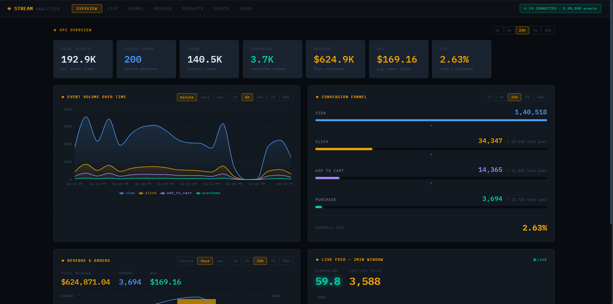
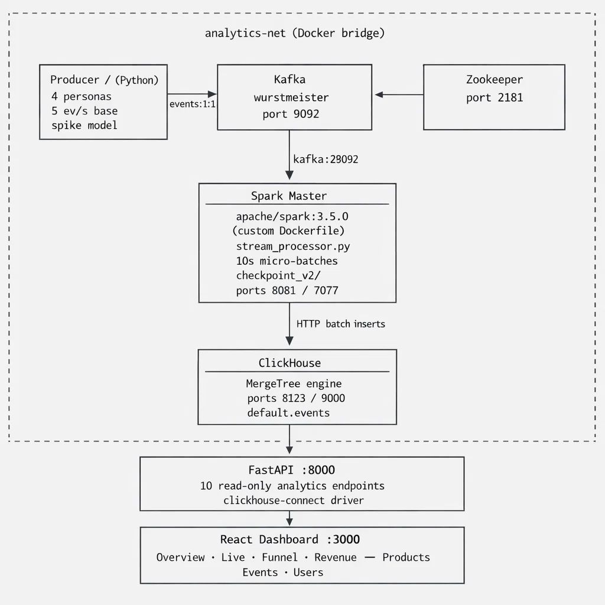

# ◈ Web Traffic Analysis

### Real-Time E-Commerce Analytics Pipeline

> A fully containerised, end-to-end streaming platform — from synthetic event generation through Kafka and Spark, into ClickHouse, surfaced via a FastAPI backend and a dark-terminal React dashboard.



---

## Architecture

<p align="center">
  
</p>

---

## Tech Stack

| Layer             | Technology                            | Role                        |
| ----------------- | ------------------------------------- | --------------------------- |
| Event Generation  | Python · kafka-python                 | Synthetic realistic traffic |
| Message Broker    | Apache Kafka + Zookeeper              | Durable event queue         |
| Stream Processing | Apache Spark 3.5 Structured Streaming | 10s micro-batch ETL         |
| Storage           | ClickHouse 24.3 (MergeTree)           | Columnar analytics DB       |
| Backend API       | FastAPI · clickhouse-connect          | 10 analytics endpoints      |
| Frontend          | React 18 · Recharts · IBM Plex Mono   | Dashboard                   |
| Orchestration     | Docker Compose · PowerShell           | One-command pipeline start  |

---

## Project Structure

```
web-traffic-analysis/
│
├── api/
│   ├── main.py                  # FastAPI — 10 analytics endpoints
│   └── .env                     # ClickHouse connection config
│
├── dashboard/
│   ├── src/
│   │   ├── App.jsx              # 7-page navigation shell
│   │   ├── api.js               # Typed API client
│   │   ├── hooks/useApi.js      # Polling data-fetch hook
│   │   └── components/
│   │       ├── Overview.jsx     # KPI stat grid
│   │       ├── Funnel.jsx       # Animated conversion funnel
│   │       ├── Timeseries.jsx   # Area chart — event volume
│   │       ├── Revenue.jsx      # Composed bar+line revenue chart
│   │       ├── TopProducts.jsx  # Ranked products table
│   │       ├── Categories.jsx   # Table + radar chart
│   │       ├── Realtime.jsx     # 2-min live rolling window
│   │       ├── EventsLog.jsx    # Paginated raw event table
│   │       ├── UserLookup.jsx   # Per-user journey viewer
│   │       └── UI.jsx           # Shared primitives
│   └── package.json
│
├── producer/
│   └── producer.py              # Realistic event generator
│                                # Personas · product tiers · spikes
│
├── spark_jobs/
│   ├── stream_processor.py      # Spark Structured Streaming job
│   ├── clickhouse-jdbc-0.6.4-shaded.jar
│   ├── checkpoint_v2/           # Streaming fault-tolerance state
│   └── spark_job.log
│
├── deploy/
│   ├── docker-compose.yaml      # Full stack orchestration
│   ├── Dockerfile               # Custom Spark image
│   ├── init-ch.sql              # ClickHouse schema
│   ├── init-clickhouse.ps1      # DB initialisation script
│   ├── .env                     # Service credentials
│   └── reset-clickhouse.ps1     # Wipe + reinitialise DB
│
├── requirements.txt
└── run_job.ps1                  # Top-level pipeline launcher
```

---

## Data Model

Events are stored in a single ClickHouse table, partitioned by month for fast time-scoped queries:

```sql
CREATE TABLE IF NOT EXISTS default.events
(
    event_id    String,
    event_type  String,      -- view | click | add_to_cart | purchase
    user_id     String,
    product_id  String,
    price       Float64,
    timestamp   DateTime,
    category    String,      -- electronics | clothing | furniture
                             -- food | books | sports
    ip_address  String
)
ENGINE = MergeTree()
PARTITION BY toYYYYMM(timestamp)
ORDER BY (timestamp, user_id)
SETTINGS index_granularity = 8192;
```

**Why MergeTree?**

- Columnar storage — aggregations read only the columns they need
- Monthly partitions — `WHERE timestamp >= now() - INTERVAL 24 HOUR` skips irrelevant partitions entirely
- Composite sort key `(timestamp, event_id)` — fast range scans and natural deduplication ordering

---

## Components In Depth

### Event Producer

`producer/producer.py` generates a continuous stream of realistic e-commerce events, with stateful per-user session tracking and layered traffic spike simulation.

**User Personas** — each user is assigned a behavioural type that controls their funnel conversion probabilities:

| Persona       | View → Click | Click → Cart | Cart → Purchase | Net CVR |
| ------------- | ------------ | ------------ | --------------- | ------- |
| Browser       | 12%          | 20%          | 8%              | ~0.2%   |
| Researcher    | 30%          | 35%          | 18%             | ~1.9%   |
| Impulse Buyer | 35%          | 50%          | 25%             | ~4.4%   |
| Loyalist      | 40%          | 55%          | 30%             | ~6.6%   |

**Blended CVR: ~2.5–3.5%** — consistent with real-world e-commerce benchmarks.

**Product Tiers** — 500 products are assigned tiers at startup with weighted sampling:

| Tier    | Catalogue Share | Traffic Weight | Effect                                 |
| ------- | --------------- | -------------- | -------------------------------------- |
| Viral   | 5%              | 12×            | High views, boosted funnel progression |
| Popular | 20%             | 4×             | Normal views, standard funnel          |
| Niche   | 75%             | 1×             | Low views, suppressed conversion       |

**Traffic Spikes** — three layered multipliers applied to the base event rate:

- **Time-of-day curve** — sinusoidal peaks at simulated lunch and evening hours
- **Flash sales** — 4× spike every 90 seconds, lasts 10 seconds with sinusoidal ramp
- **Viral bursts** — random 2–5× surges lasting 5–15 seconds, every 30–120 seconds

```bash
# Run the producer standalone
python producer/producer.py --rate 5 --users 200 --broker localhost:9092
```

<br/>

---

### Kafka

| Setting           | Value                                        |
| ----------------- | -------------------------------------------- |
| Image             | `wurstmeister/kafka:latest`                  |
| Topic             | `events` — 1 partition, replication factor 1 |
| Auto-created via  | `KAFKA_CREATE_TOPICS: "events:1:1"`          |
| Retention         | 2 hours (development mode)                   |
| Authentication    | None — PLAINTEXT listeners                   |
| Internal listener | `kafka:29092` — Spark reads from here        |
| External listener | `localhost:9092` — producer writes here      |

Zookeeper runs alongside for broker coordination, topic management, and leader election.

---

### Spark Streaming Job

`spark_jobs/stream_processor.py` is the core ETL component, running as a Spark Structured Streaming application.

The custom `deploy/Dockerfile` extends `apache/spark:3.5.0` to add:

- Python 3 + pip + `requests` library (for HTTP writes to ClickHouse)
- ClickHouse JDBC driver pre-loaded at image build time
- PySpark Python runtime paths configured
- Non-root `spark` user for container security

**Spark submit configuration used by `run_job.ps1`:**

```powershell
spark-submit `
  --master local[*] `
  --packages org.apache.spark:spark-sql-kafka-0-10_2.12:3.5.0 `
  --jars /opt/spark-apps/clickhouse-jdbc-0.6.4-shaded.jar `
  /opt/spark-apps/stream_processor.py
```

Spark Master UI is available at **http://localhost:8081** once running.

<br/>

---

### ClickHouse

| Setting         | Value                                                 |
| --------------- | ----------------------------------------------------- |
| Image           | `clickhouse/clickhouse-server:24.3`                   |
| HTTP API port   | `8123` — used by Spark writes and FastAPI reads       |
| Native TCP port | `9000` — native client protocol                       |
| Engine          | MergeTree                                             |
| Partitioning    | Monthly (`toYYYYMM(timestamp)`)                       |
| Persistence     | Docker volume `clickhouse_data/`                      |
| Init            | `init-clickhouse.ps1` waits for health, creates table |

---

### FastAPI Backend

`api/main.py` provides 10 read-only analytics endpoints backed by ClickHouse SQL queries via `clickhouse-connect`. A single persistent client is created at startup via the `lifespan` context manager and shared across all requests.

All time-windowed queries use ClickHouse's native `now() - INTERVAL N HOUR/DAY` expressions, ensuring partition pruning is applied automatically.

Interactive docs auto-generated at **http://localhost:8000/docs**

<br/>

---

### React Dashboard

Dark industrial terminal aesthetic — IBM Plex Mono throughout, amber/green accent colours, scanline overlay, glowing live indicators, and smooth bar transitions on load.

Polling strategy: `/metrics/realtime` is polled every 5 seconds for the live feed; all other endpoints are fetched on page load and window/filter change.

<br/>

---

## Getting Started

### Prerequisites

| Tool           | Version        |
| -------------- | -------------- |
| Docker Desktop | Latest         |
| Python         | 3.10+          |
| Node.js        | 18+            |
| PowerShell     | 5.1+ (Windows) |

### 1 — Clone and configure

```bash
git clone <your-repo-url>
cd web-traffic-analysis
```

Copy and populate credentials:

```bash
cp deploy/.env.example deploy/.env
cp api/.env.example api/.env
# Edit both files with your ClickHouse password
```

### 2 — Start infrastructure

```bash
cd deploy
docker-compose up -d
```

Wait for all services to pass health checks:

```bash
docker-compose ps
# All services should show status "healthy"
```

### 3 — Run the full pipeline

```powershell
# From project root — initialises DB, starts producer, submits Spark job
./run_job.ps1
```

What this script does, in order:

1. Loads `deploy/.env` — injects ClickHouse credentials into the session
2. Runs `init-clickhouse.ps1` — waits for ClickHouse readiness, creates `default.events`
3. Starts `producer.py` inside the Spark container
4. Stops any previous Spark streaming jobs to avoid offset conflicts
5. Runs `spark-submit` with Kafka connector package + ClickHouse JDBC jar

### 4 — Start the API

```bash
cd api
pip install fastapi uvicorn clickhouse-connect python-dotenv
uvicorn main:app --reload --port 8000
```

Verify: http://localhost:8000/health — should return `{"status": "ok", "clickhouse": "connected"}`

### 5 — Start the dashboard

```bash
cd dashboard
npm install
npm start
# Opens http://localhost:3000
```

### Reset everything

```powershell
# Wipe ClickHouse data and reinitialise schema from scratch
./deploy/reset-clickhouse.ps1
```

---

## Environment Variables

### `deploy/.env`

```dotenv
CLICKHOUSE_USER=default
CLICKHOUSE_PASSWORD=your_password
```

### `api/.env`

```dotenv
CH_HOST=localhost
CH_PORT=8123
CH_USER=default
CH_PASSWORD=your_password
CH_DB=default
```

---

## Service Ports

| Service           | Port    | Purpose                                |
| ----------------- | ------- | -------------------------------------- |
| Zookeeper         | `2181`  | Kafka broker coordination (internal)   |
| Kafka             | `9092`  | Producer writes (external)             |
| Kafka internal    | `29092` | Spark reads (internal Docker DNS)      |
| ClickHouse HTTP   | `8123`  | Spark writes · API reads · HTTP client |
| ClickHouse Native | `9000`  | Native TCP protocol                    |
| Spark Master UI   | `8081`  | http://localhost:8081 — job monitoring |
| Spark submission  | `7077`  | `spark-submit --master spark://...`    |
| FastAPI           | `8000`  | http://localhost:8000                  |
| React             | `3000`  | http://localhost:3000                  |

> ⚠️ **Security note:** Kafka uses PLAINTEXT with no authentication — do not expose port `9092` publicly. ClickHouse is protected by username/password passed via environment variables.

---

## API Reference

All endpoints return JSON. All metrics endpoints accept:

| Parameter | Options                    | Default |
| --------- | -------------------------- | ------- |
| `window`  | `1h` `6h` `24h` `7d` `30d` | `24h`   |
| `bucket`  | `minute` `hour` `day`      | `hour`  |
| `limit`   | `1` – `1000`               | `50`    |

**Quick examples:**

```bash
# Overall KPIs
curl http://localhost:8000/metrics/overview?window=24h

# Conversion funnel with drop-off %
curl http://localhost:8000/metrics/funnel?window=7d

# Top 10 products by revenue
curl http://localhost:8000/metrics/top-products?by=revenue&limit=10

# Single user journey
curl http://localhost:8000/metrics/users/u_42?window=7d

# Rolling live window
curl http://localhost:8000/metrics/realtime
```

Full interactive docs: **http://localhost:8000/docs**

---

## Dashboard Pages

| Page         | Key Visuals                                                             |
| ------------ | ----------------------------------------------------------------------- |
| **Overview** | 7 KPI tiles · area chart · funnel · revenue chart · live feed           |
| **Live**     | Stacked bar rolling 2-min window · events/sec counter (polled every 5s) |
| **Funnel**   | Animated drop-off bars · category radar chart (table + radar toggle)    |
| **Revenue**  | Composed bar+line chart · total revenue / orders / AOV summary          |
| **Products** | Top-8 table with inline progress bars · per-product CVR                 |
| **Events**   | Paginated raw log · event type filter · prev/next pagination            |
| **Users**    | User ID search → event timeline · spend / sessions / products viewed    |

All time-window and bucket controls update charts in-place without a page reload.

---

## Fault Tolerance

Spark Structured Streaming maintains checkpoint state in `spark_jobs/checkpoint_v2/`:

- **Kafka offsets** are committed only after each batch is successfully written to ClickHouse
- **State recovery** — if the Spark job crashes and restarts, it resumes from the last committed offset with no data loss
- **No double-counting** — Kafka offset tracking ensures each event is processed exactly once per restart

ClickHouse data persists across container restarts via the `clickhouse_data/` Docker volume.

---
